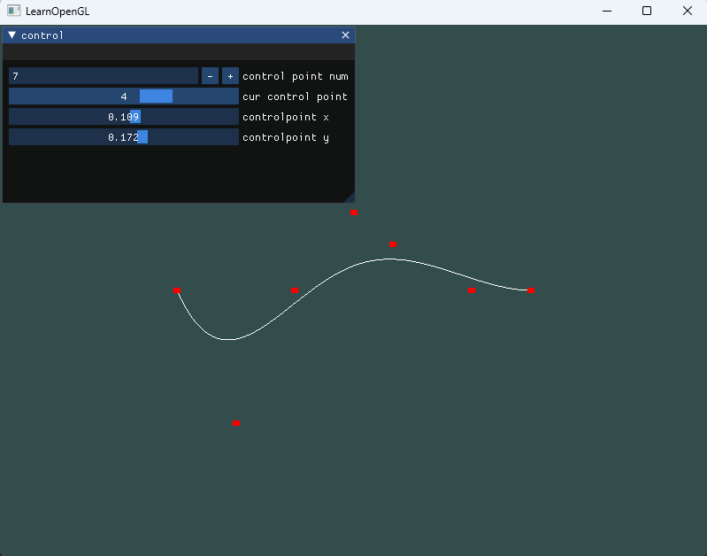
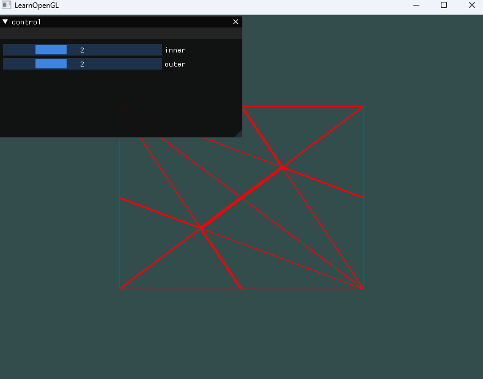
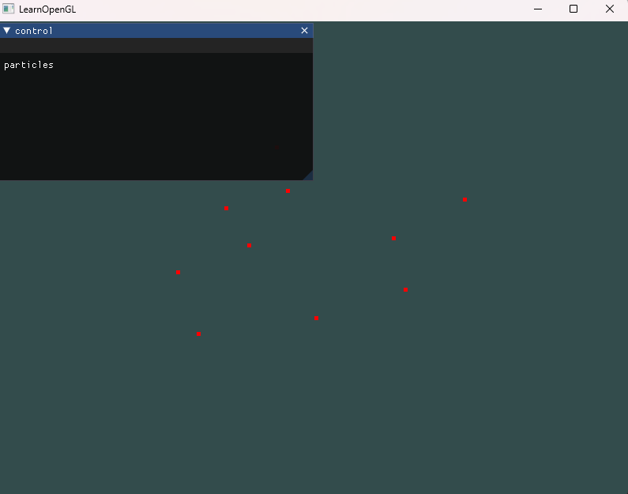

# sjtu-se-cg
a repo for tutorial

# demos
## bezier curve

a program of simple bezier curve implement

## tessellation
a program of simple tesselation example

## particles
a program of simple cs particles

# request
* imgui
* glfw
* glad

# install using vcpkg
    vcpkg integrate install
    vcpkg install glfw3:x64-windows
    vcpkg install glad:x64-windows
    vcpkg install imgui[core,opengl3-binding,glfw-binding]:x64-windows
