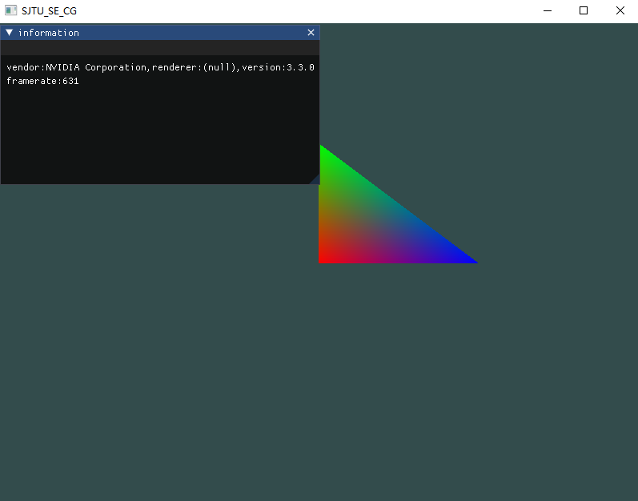

# demo

basic homework architecture with minimum code

# request
* glfw
* glad
* imgui(recommend to install for easy ui operation)
* assimp(optional, for model operation)
* eigen(optional, for math calculation)

# environment install using vcpkg
vcpkg是微软推出的一款库管理软件,也是我觉得目前较为简易的windows+visual studio工作环境下的依赖配置软件

安装和使用说明详见 [microsoft vcpkg](https://github.com/microsoft/vcpkg)

    vcpkg integrate install
    vcpkg install glfw3:x64-windows glad:x64-windows imgui[core,opengl3-binding,glfw-binding]:x64-windows
    vcpkg install assimp:x64-windows eigen3:x64-windows

if you installed successful, you can see the following image

# some attention
* pay attention to the relative path of your resource file when you upload your executable binary

# other platform
for platform that is not windows, i recommend you to rely on the cmake to build your own proj. you can reference to the cmake proj like [learnopengl](https://github.com/JoeyDeVries/LearnOpenGL), or some simpler ones like [OpenGLSampleCmake](https://github.com/Shot511/OpenGLSampleCmake)